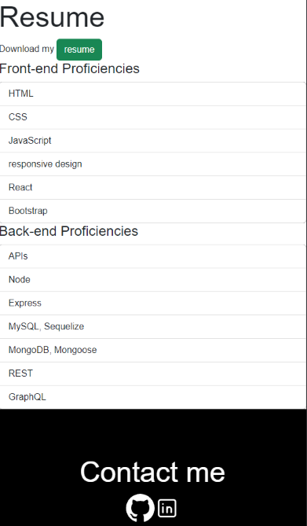

# Portfolio

## Description

The source code for my single-page <a href="https://joesen-dev.github.io/react-portfolio/">React Portfolio</a>, which includes examples of my work, can be found in this repository. You can access my resume in the portfolio's "Resume" Section or by clicking a link in the footer to my LinkedIn profile.

## Table of Contents

- [Technologies](#technologies)
- [Screenshots](#screenshots)
- [Questions](#questions)

## Technologies

- React
- Reactbootstrap
- Bootstrap
- NodeJS

## Screenshots

**hero banner(mobile)**

**Resume page(mobile)**

## Questions

**How to reach me**

- <a href="https://github.com/joesen-dev">Github</a>
- Email senjoseph90@gmail.com
