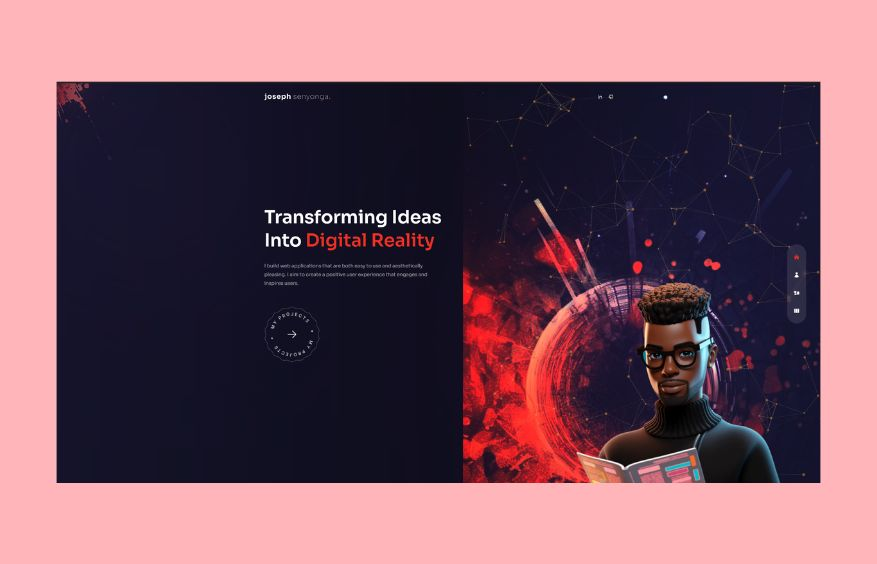

# Portfolio README

## Description

Welcome to my <a href="https://joesen-dev.netlify.app/">portfolio</a>! This is a collection of web development projects and design work that showcases my skills and expertise in various areas. From front-end to back-end, and even full-stack applications, each project represents a unique challenge I've tackled using cutting-edge technologies and creative design.

## Table of Contents

1. [About Me](#about-me)
2. [Technologies](#technologies)
3. [Screenshots](#screenshots)
4. [Contact](#contact)

## About Me

I'm a passionate web developer and designer with a diverse skill set that includes creating seamless user experiences and building robust applications. I'm committed to delivering high-quality solutions that leave a lasting impact.

## Technologies

Here are some of the key technologies I've utilized for this project:

- NextJS: A robust React framework for building server-rendered applications.
- Tailwind CSS: A utility-first CSS framework that enables rapid UI development.
- NodeJS: A runtime environment for executing JavaScript server-side.
- Framer Motion: An animation library for creating fluid and engaging user interfaces.
- Swiper: A touch-enabled JavaScript library for creating responsive and customizable sliders.

## Screenshots

## Contact

I'm excited to connect with prospective employers and discuss opportunities. Feel free to reach out to me via [email](mailto:josephsenyonga38@gmail.com) or connect with me on [LinkedIn](https://www.linkedin.com/in/josephsenyonga38/).
